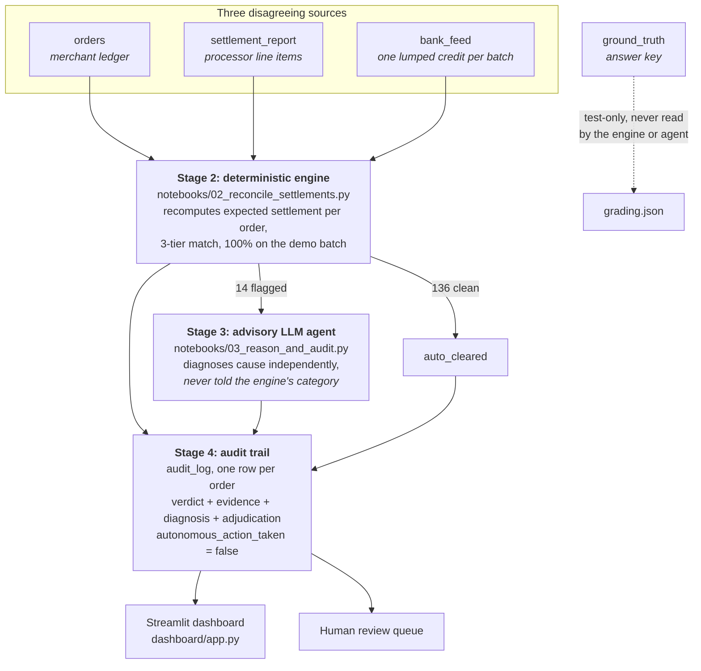

# SettleTrace

A settlement reconciliation engine that explains its exceptions instead of just flagging them, and is architecturally incapable of acting on them.

## The problem

A payment processor does not pay a merchant per order. It nets a day's orders
into **one lumped bank credit**: hundreds of transactions, minus MDR fees, minus
18% GST on those fees, minus refunds, arriving T+2 under a single UTR.

The merchant's ledger says one thing. The settlement report says another. The
bank statement says a third. When they disagree, somebody has to work out which
of the three is right, for which order, and why. That work is manual, it happens
under a month-end close deadline, and the answer is almost never "the money is
missing". It is usually a refund that missed the cycle cutoff, a fee charged at
2.1% instead of 2%, a payout line that got written twice, or an order that
silently dropped out of the batch.

Two things make this worth automating properly rather than with a SQL join:

**A match rate is not an answer.** Knowing that 14 of 150 orders broke tells a
finance team nothing they can act on. They need to know *which* break is a
timing artifact that will resolve itself next cycle, and which is a fee dispute
worth raising with the processor.

**Money moves at the end of it.** Anything that writes back to a ledger,
reissues a payout, or corrects a settlement has to be explainable after the
fact, to an auditor, six months later, by someone who was not there when it ran.

SettleTrace unpacks the lumped credit back to order level, classifies every
order deterministically, asks a language model to independently explain the
exceptions, and writes an audit record for every order that states what was
decided, on what evidence, and that nothing was actioned.

## How it works



The two layers are deliberately unequal. The **engine is authoritative**: it
decides the category, its logic is inspectable line by line, and it scores
150/150. The **agent is advisory**: it explains and recommends, and it can never
clear work, only add doubt. Where they disagree, the order escalates to a human
rather than resolving toward either one.

That split is not caution for its own sake. It is a measured decision: a 7B
model scored 17/19 against the same answer key the engine gets 150/150 on, so
letting the model overrule the engine would *lower* accuracy.

## How this maps to "the bar"

> "Every money action explainable, bounded and gated."

| Requirement | How it is enforced | Where to verify it |
|---|---|---|
| **Explainable** | Every audit record carries the engine's verdict *and the figures it compared*, so the decision is re-checkable without re-running anything. Where the agent ran, its explanation is stored verbatim, with the model name, a SHA-256 of the exact prompt, and a fingerprint of the exact evidence shown to it. | `data/audit_log/audit_log.jsonl`, `EngineEvidence` in `scripts/audit_trail.py` |
| **Bounded** | The agent picks from a closed set of causes enforced by a JSON schema and a Pydantic model. It cannot invent a category, and it cannot express a remediation in prose and have that treated as an instruction. | `EXCEPTION_CAUSES`, `RESPONSE_JSON_SCHEMA` in `scripts/reasoning_agent.py` |
| **Gated** | Every flagged order routes to human review regardless of the agent's confidence. Disagreement between engine and agent escalates rather than resolving. | `decide_review()` in `scripts/audit_trail.py` |
| **No autonomous action** | There is no execution path in this repository. `action_taken: "none"` and `autonomous_action_taken: false` are on **every record**, not just the run summary, and are constants by construction rather than values a run could set otherwise. | any row of `audit_log`; verified on the cluster by querying `SUM(autonomous_action_taken) = 0` |

One measurement drove the gating design. **Confidence is not a usable routing
signal**: on the 7B run, mean agent confidence was 0.961 and the two wrong
answers came in at 0.95 and 1.00, at or above average. An auto-clear threshold
at 0.95 would have passed both misses through. That is why nothing auto-clears
on agent confidence, on any model.

Note on provenance: the wording above is quoted from the brief. It is not
otherwise reproduced in this repository.

## Quickstart

```bash
uv sync
```

Everything below runs against the frozen 150-order demo batch committed in
`data/demo_batch/`, so none of it needs a cluster or a network.

**Reconcile, and check the classification against the answer key:**

```bash
.venv\Scripts\python.exe scripts/test_reconcile_local.py
```

**Run all four stages end to end, without needing a model:**

```bash
.venv\Scripts\python.exe scripts/run_pipeline.py --no-llm
```

**Run it with the reasoning stage, against a Databricks serving endpoint:**

```bash
.venv\Scripts\python.exe scripts/run_pipeline.py
```

**See it:**

```bash
.venv\Scripts\streamlit.exe run dashboard/app.py
```

**Measure throughput at scale:**

```bash
.venv\Scripts\python.exe scripts/scale_test.py
```

Anything that runs Spark needs a JDK (tested with Temurin 17) plus `JAVA_HOME`,
`PYSPARK_PYTHON` and `PYSPARK_DRIVER_PYTHON` pointed at a real interpreter. See
the docstring in `scripts/test_reconcile_local.py` for the exact environment.

## Results

### Classification accuracy

The deterministic engine, graded against `ground_truth`, which it never reads:

| Batch size | Orders | Exceptions | Reconcile time | Accuracy |
|---|---|---|---|---|
| Demo | 150 | 14 | 2.75s | **150/150 (100%)** |
| | 1,000 | 95 | 2.68s | **100%** |
| | 5,000 | 475 | 2.95s | **100%** |
| | 20,000 | 1,900 | 3.25s | **100%** |
| | 50,000 | 4,750 | 4.88s | **100%** |

### Throughput

Measured by `scripts/scale_test.py` on local Spark (`local[*]`, one laptop, not
a cluster), so absolute times are not Databricks times. The useful signal is how
cost grows:

**333x the orders costs 1.8x the reconcile time.** Work is dominated by fixed
Spark overhead rather than per-order cost, and per-order throughput rises from
55 orders/sec at demo size to 10,242 orders/sec at 50,000. Session startup
(6.3s) is measured once and excluded, since it is paid per job rather than per
order, and a discarded warm-up run absorbs first-job JIT so that cost does not
land on whichever size happens to be measured first.

Stage 3 is deliberately not in that table. It is one network call per flagged
order, so its cost is set by endpoint latency and concurrency, not by this
engine; timing it on a laptop would measure the model host.

### Engine vs. agent

Same prompt, same 19 orders (14 flagged plus 5 clean controls), different model:

| Backend | Model | Agent vs. `ground_truth` |
|---|---|---|
| Databricks FM API | `databricks-meta-llama-3-3-70b-instruct` | **19/19 (100%)** |
| Local server | `qwen2.5-7b-instruct` | 17/19 (89.5%) |

The engine scores 150/150 in every case. Clean controls: 5/5 on both backends,
so neither model invented exceptions on clean orders.

`PROMPT_VERSION` is a SHA-256 of the prompt text, so rewording it re-versions
every record automatically. That was exercised: the prompt was reworded (only
punctuation changed), the hash moved from `e07e929411a5` to `39b2e0228d39`, and
the cluster run was repeated under the new hash. **The 70B reproduced 19/19**,
so the reword changed the provenance and not the behaviour, which is the point
of deriving the version from the text rather than maintaining it by hand.

Mean confidence on that run was 0.932, and all 19 explanations cited a specific
figure rather than restating the category name (`explanation_cites_figures` in
`scripts/audit_trail.py`, recorded per row and counted per run).

The committed artifacts in `data/audit_log/` are still the older 7B run at
`e07e929411a5`, kept deliberately: it is the run where the agent gets two orders
wrong, so it is the one that demonstrates the disagreement path actually
working. The live `audit_log` Delta table is the current 70B run.

### The two failure modes the 7B model had and the 70B did not

Both local-model errors were false negatives on small-value orders, and both are
instructive:

- On an `mdr_rate_mismatch` order it correctly *listed* the discrepancy
  (expected MDR 5.75 vs. actual 6.04) and then dismissed it as "minimal, could
  be due to rounding". That is a materiality error: ₹0.29 is small in absolute
  terms but a ~5% error in the fee rate, which the engine's fixed tolerance
  catches without judgement.
- On a `duplicate_transaction` order it described the settlement line in the
  singular despite being shown two: a structural counting blind spot, still
  present at `temperature=0`.

**Both errors were contained by the architecture.** The engine had both orders
right, both were logged as `disagree`, and both escalated to human review. The
agent's mistakes changed no outcome.

### Reproducibility, measured rather than assumed

Running the identical 19 cases twice at `temperature=0`, with identical input
fingerprints, produced the same **cause** every time (0 of 19 changed) but
different **prose** on 11 of 19, and a different `confidence` on 2. The server's
kernels are nondeterministic below the sampler, so `temperature=0` stabilises
the field that drives routing without making a run reproducible.

That is precisely why the audit trail stores each explanation verbatim instead
of regenerating it on demand. Re-running tomorrow produces different words for
the same order, so the log is the only record of what was actually said.

## The components

### `notebooks/01_generate_synthetic_data.py`

Generates four linked tables: `orders`, `settlement_report`, `bank_feed`, and
`ground_truth`. Exception rates and scale are widget-controlled; the defaults
produce 150 orders at seed 42.

Everything derives from a private `random.Random(SEED)` rather than the
process-global RNG, and the canonical batch's `order_id` sequence is pinned to a
SHA-256 digest asserted at generation time. Both exist because the frozen batch
was once *not* reproducible across environments: the module-level `random`
functions share one Mersenne Twister with every library in the interpreter, so
anything drawing from it before generation silently shifted the output for a
fixed seed. See the Day 6 entry in `docs/day-log.md`.

`ground_truth` is the answer key: one row per order with the true label and a
short explanation. A real engine would have to reconstruct it; it exists here
only to grade one.

### `notebooks/02_reconcile_settlements.py`

Reads only `orders`, `settlement_report` and `bank_feed`, never `ground_truth`,
and recomputes what each order's settlement line *should* look like.

- **exact**: one settlement line, and the full identity ties out within
  tolerance, including `gst_on_mdr` and `net_amount`, not just the two fields
  with exception types attached to them.
- **fuzzy**: linked correctly, one figure does not tie out. `mdr_rate_mismatch`,
  `timing_lag_refund`, or `unexplained_value_break` for a line whose own
  arithmetic does not add up and which no known exception type explains.
- **no_match**: cannot be linked at all. `missing_payout` or
  `duplicate_transaction`.

A separate batch-level check cross-references `bank_feed` against summed
`settlement_report.net_amount`, the multi-source half of the reconciliation.

Two details worth knowing. The identity is evaluated on the figures the
settlement file **actually charged**, not on expected ones, because rebuilding a
net from expected figures lets independent per-field rounding differences
compound past the tolerance and flag orders where nothing is wrong; a 1000-order
scale run found exactly that. And `breaks_tolerance()` rounds a delta to paise
before comparing, because Python rounds HALF_EVEN and Spark HALF_UP, so the two
can legitimately land a paisa apart on identical arithmetic.

### `notebooks/03_reason_and_audit.py`

The production reasoning path. Reads `reconciliation_result`, sends every
flagged order plus a deterministic sample of clean controls to a Foundation
Model API endpoint, and writes the `audit_log` Delta table.

Reached over the OpenAI-compatible protocol at `<host>/serving-endpoints`, with
auth from the notebook's own identity, so there are no secrets in the notebook.
The prompt, response schema, case builder and audit schema are all imported from
`scripts/`, so the cluster and the local runner cannot drift apart.

Verified on the live cluster by querying the table rather than trusting the
notebook's printed output:

| Check | Result |
|---|---|
| `audit_log` rows | 150 |
| Review queue | 14 `needs_human_review`, 136 `auto_cleared` |
| `action_taken` distinct values | `none` |
| `autonomous_action_taken` sum | **0** |
| Engine vs. agent on flagged | 14 agree, 0 disagree |
| Agent vs. `ground_truth` (test-only) | **19/19** |

### `scripts/run_pipeline.py`

The same four stages on a laptop, for iterating without a cluster. Stage 2
executes the real notebook source through `scripts/local_spark_harness.py`, so
this is not a reimplementation of the engine.

Flags: `--no-llm` (stages 1, 2 and 4 with no model at all, skipped diagnoses
logged as skipped rather than left blank), `--backend local`, `--clean-controls
N`, `--limit N`, `--out DIR`.

### Outputs (`data/audit_log/`)

| File | Contents |
|---|---|
| `audit_log.jsonl` | One full record per order: engine verdict and evidence, agent diagnosis, adjudication, governance fields |
| `audit_log.csv` | The same records flattened for spreadsheet review |
| `run_summary.json` | Run-level rollup: tiers, categories, agreement, review queue, model and prompt provenance |
| `grading.json` | **Test-only** accuracy of engine and agent vs. `ground_truth` |

`grading.json` is a separate file and `ground_truth` is kept out of the audit
schema entirely, for the same reason notebook 02 quarantines its accuracy cell:
the answer key exists to grade the system, and nothing that would run in
production may read it.

### `dashboard/app.py`

A Streamlit view over the audit log, not over the raw tables. The audit record
already carries the verdict, the evidence, the diagnosis and the governance
fields, so the dashboard is a view over one source rather than a second place
where reconciliation logic lives. Switchable between the committed local run
(instant, offline, use this for a demo) and the live Delta table (a stopped SQL
warehouse takes ~30s to wake, which is not something to discover on stage).

The card worth opening in a demo is order `504d281f`: the engine flags an MDR
mismatch, the agent calls it clean at 0.95 confidence, and the card puts the
expected-vs-actual figures next to the agent's own words dismissing a ~5% rate
error as "minimal". The disagreement, the evidence, and the fact that nothing
was actioned are all visible at once.

Agent explanations are model-written text rendered into an HTML page, so they
are escaped before rendering rather than trusted.

## The demo batch

`data/demo_batch/*.csv` is a frozen, checked-in export of the canonical run
(`num_orders=150`, `seed=42`), so results do not move because someone reran the
generator. Regenerate with:

```bash
uv run python scripts/export_demo_batch.py
```

This executes the notebook's own generation logic locally, stubbing the
Databricks-injected globals, so the generation logic has one source of truth
rather than being duplicated between the notebook and the export script.

## Databricks setup

1. Install the Databricks CLI (`winget install Databricks.DatabricksCLI`).
2. `databricks auth login --host <workspace-url>`.
3. Connect this repo as a **Git folder** in the workspace.
4. Run notebooks 01, 02, 03 in order.

Note that a git push does not update the workspace: the Git folder is a separate
clone and needs its own pull, and the Delta tables only change when a notebook
is actually run.

## Stack

- Databricks and PySpark for batch reconciliation
- Databricks Foundation Model APIs for the reasoning layer
  (`databricks-meta-llama-3-3-70b-instruct` by default), with a local
  OpenAI-compatible backend for offline iteration
- Streamlit and Plotly for the dashboard
- `uv` for environment and dependency management

## Known limitations

- **The agent is measured on 19 orders**, not 150. Clean controls are sampled
  rather than exhaustive, so the false-positive rate is an estimate.
- **`unexplained_value_break` and orphan settlement lines never fire on this
  batch.** Both paths are correct by inspection and unexercised by real data.
- **Throughput above is local Spark on one laptop**, not a cluster, and covers
  stages 1, 2 and 4. Stage 3 cost is set by the serving endpoint.
- **The synthetic data is synthetic.** Real settlement files carry FX, chargebacks,
  partial captures and processor-specific fee schedules that this does not model.
